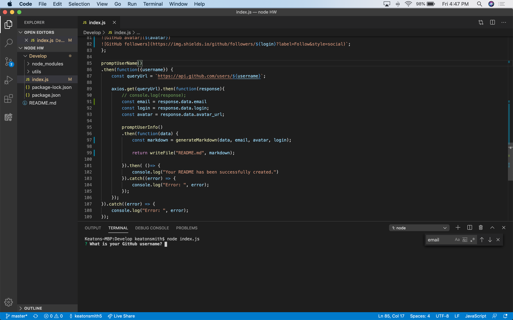
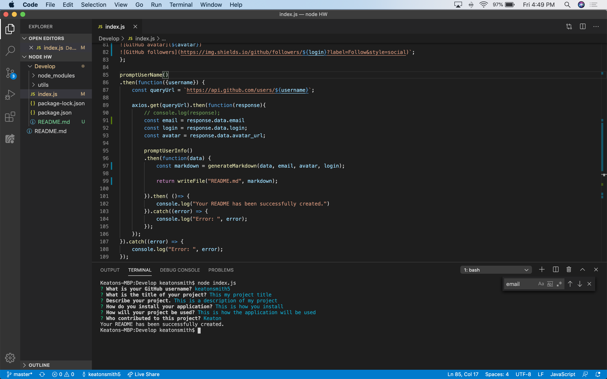
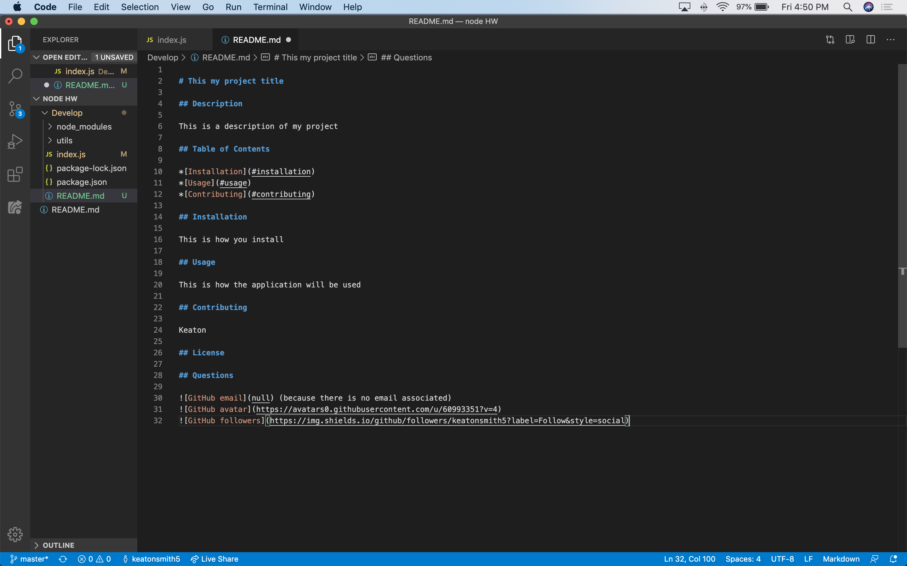
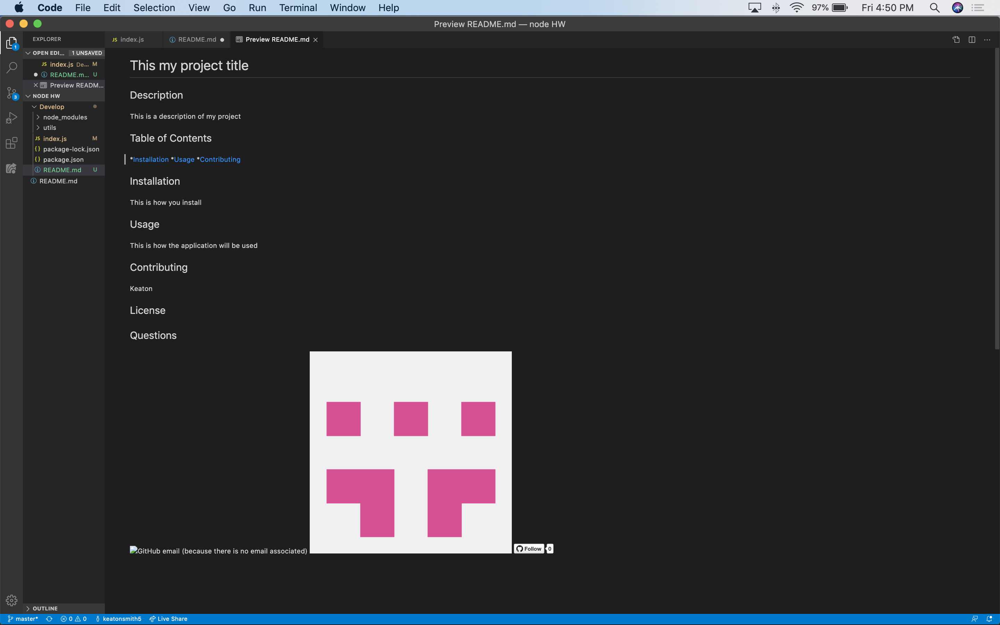

# README Generator

## Description

The user will be prompted for their GitHub username, which will be used to make a call to the GitHub API to retrieve their email and profile image. They will then be prompted with questions about their project. The README will be populated with the following: At least one badge, Project title, Description, Table of Contents, Installation, Usage, License, Contributing, Questions, User GitHub profile picture, User GitHub email.

AS A developer
I WANT a README generator
SO THAT I can easily put together a good README for a new project

## Table of Contents

*[Installation](#installation)
*[Usage](#usage)
*[Contributing](#contributing)

## Installation

  1. Include the package folder within your project directory.
  2. Open your terminal to your current project directory.
  3. Type "node index.js" in the console.
  4. You will then be asked your Github username and several questions about your project.
  5. Once questions are successfully answered, a generated README.md will be created and placed in your project's directory.

## Usage

This is how the application will be used to quickly and effectively generate a README for your project.

GIVEN the developer has a GitHub profile and a repository
WHEN prompted for the developer's GitHub username and repo specific information
THEN a README for the repo is generated

I have attached some screenshots below to show how it works.

## Contributing

Keaton Smith

## Questions

 (because there is no email associated)

## License